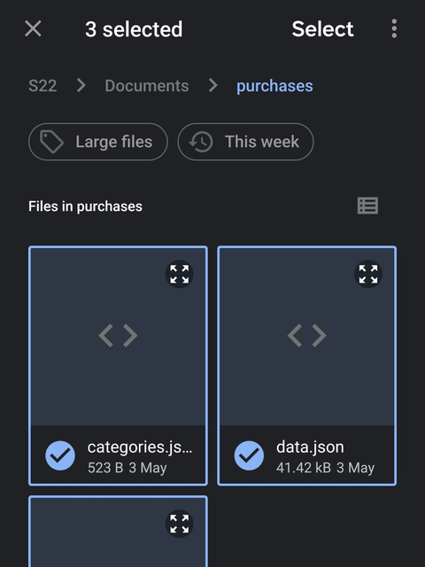
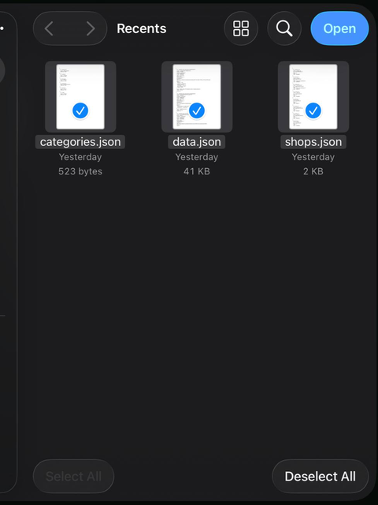

# Local Purchase Tracker

Personal purchase tracker. Runs in the browser, data stays in local JSON files — no server, no cloud.

**[Open app →](https://defire04.github.io/local-purchase-tracker/)**

---

## Getting started

The app shows different options depending on your browser's capabilities.

**If you see "Open data folder"** — click it, select a folder with your 3 files. Changes save automatically. On first launch with an empty folder, grant write permission when prompted.
To attach local receipts (PDF, photos), place them in a `receipts/` subfolder inside your data folder — the app reads them directly without uploading anywhere.

**If you only see "Select data files"** — select all 3 files at once. To save changes, click **Save** — all 3 files download; replace the originals on your device. Local receipt files are not accessible in this mode.

| Android — long-press the first file, then tap the rest | iOS — tap all 3 files, then Open |
|---|---|
|  |  |

> **First time?** Click "Start with empty data", then Save to create the 3 files.

---

## JSON structure

### `data.json` — purchases
```json
[
  {
    "id": "uuid",
    "name": "Toshiba P300 1TB",
    "brand": "Toshiba",
    "category": "category-uuid",
    "shop": "shop-uuid",
    "order": "#624948",
    "date": "04.10.2019",
    "price": 1019,
    "warrantyMonths": 24,
    "serialNumber": "ABC123",
    "executor": "",
    "status": "active",
    "note": "...",
    "link": "https://...",
    "ekLink": "https://ek.ua/...",
    "specs": { "Storage": "1 TB" },
    "receipts": [{ "type": "url", "label": "Invoice", "value": "https://..." }],
    "events": [{ "date": "01.01.2021", "type": "repair", "note": "Fixed screen" }]
  }
]
```

`status`: `active` · `returned` · `written_off`

`receipts[].type`: `url` · `pdf` · `photo`

`events[].type`: `warranty_claim` · `repair` · `returned` · `note`

`executor` — used for service categories (contractor / company name); warranty and S/N are hidden for services.

### `shops.json` — stores
```json
[
  {
    "id": "uuid",
    "name": "Amazon",
    "url": "https://amazon.com",
    "login": "user@email.com",
    "note": "",
    "color": "#60a5fa"
  }
]
```

### `categories.json`
```json
[
  {
    "id": "uuid",
    "name": "Electronics",
    "isService": false
  }
]
```

`isService: true` — hides warranty, serial number, brand and specs fields for that category.

---

## Features

- Search by name, order number, serial number
- Filter by category / brand / shop / warranty / status
- Group by order, shop, month, category
- Warranty tracking with expiry alerts
- Attach receipts: URL links, local PDF and photo files (folder mode only — stored in `receipts/` subfolder)
- Export to Excel
- Works offline, no account needed

---

## License

MIT © [defire04](https://github.com/defire04)
